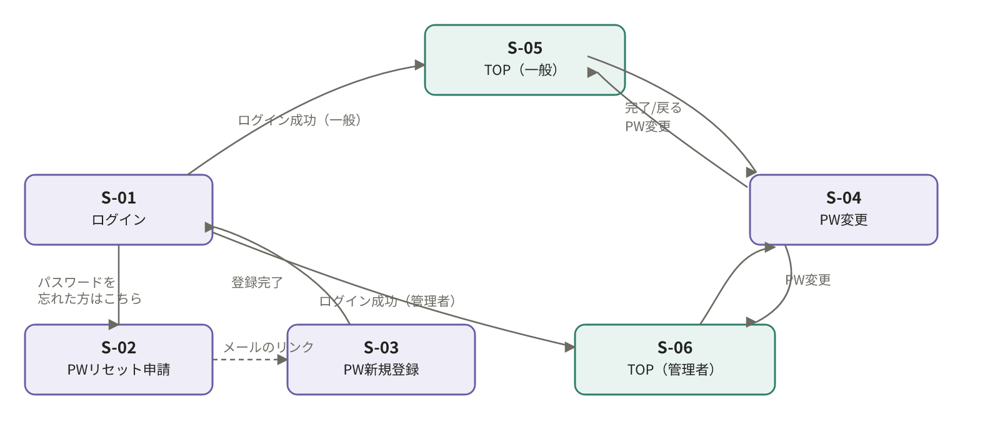
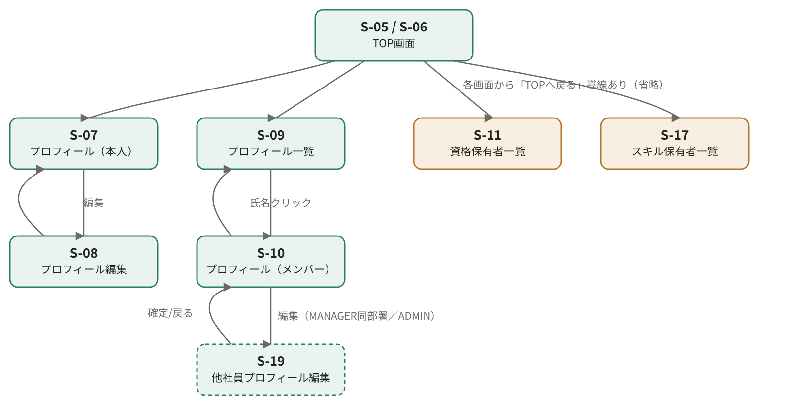
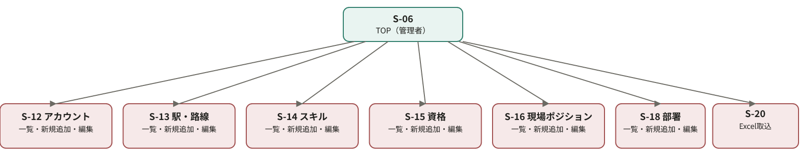

# 画面遷移図

## 目次

**画面遷移図**

| No | シート名 | リンク |
| --- | --- | --- |
| 1 | 01_画面遷移一覧 | [開く](#01_画面遷移一覧) |
| 2 | 02_認証・パスワード系 | [開く](#02_認証系) |
| 3 | 03_プロフィール・横断検索系 | [開く](#03_プロフィール横断検索系) |
| 4 | 04_マスタ管理系 | [開く](#04_マスタ管理系) |

## 01_画面遷移一覧

| 画面ID | 画面名 | 遷移元 | 遷移先 / アクション |
| --- | --- | --- | --- |
| S-01 | ログイン | ― | ログイン成功→S-05/S-06（ロール分岐）／「パスワードを忘れた方はこちら」→S-02 |
| S-02 | PWリセット申請 | S-01 | 送信完了→（メール経由）S-03／戻る→S-01 |
| S-03 | PW新規登録 | S-02（メールリンク） | 確定→S-01 |
| S-04 | PW変更 | S-05 / S-06 | 確定 or 戻る→元のTOP画面 |
| S-05 | TOP（一般） | S-01 | S-07 / S-09 / S-11 / S-17 / S-04／ログアウト→S-01 |
| S-06 | TOP（管理者） | S-01 | S-05と同じ導線＋S-12 / S-13 / S-14 / S-15 / S-16 / S-18 / S-20 |
| S-07 | プロフィール（本人） | S-05 / S-06 | 編集→S-08／TOPへ戻る |
| S-08 | プロフィール編集 | S-07 | 確定 or 戻る→S-07 |
| S-09 | プロフィール一覧 | S-05 / S-06 | 行クリック→S-10／TOPへ戻る |
| S-10 | プロフィール（メンバー）閲覧 | S-09 | 一覧に戻る→S-09／編集（権限あれば）→S-19 |
| S-19 | プロフィール編集（他社員） | S-10（MANAGER同部署 / ADMINのみ） | 確定 or 戻る→S-10 |
| S-11 | 資格保有者一覧 | S-05 / S-06 | TOPへ戻る |
| S-17 | スキル保有者一覧 | S-05 / S-06 | TOPへ戻る |
| S-12 | アカウント一覧/追加/編集 | S-06 | 一覧⇄新規追加・編集（モーダル内で完結）／TOPへ戻る |
| S-13 | 駅・路線一覧/追加/編集 | S-06 | 同上 |
| S-14 | スキル一覧/追加/編集 | S-06 | 同上 |
| S-15 | 資格一覧/追加/編集 | S-06 | 同上 |
| S-16 | 現場ポジション一覧/追加/編集 | S-06 | 同上 |
| S-18 | 部署一覧/追加/編集 | S-06 | 同上 |
| S-20 | Excel取込 | S-06 | アップロード→取込結果表示／TOPへ戻る |

## 02_認証系

① 認証・パスワード系（S-01〜S-04）

S-02→S-03はメール経由（別チャネル）のため破線で表示。

## 03_プロフィール横断検索系

② プロフィール・横断検索系（S-05〜S-11, S-17, S-19）

S-19は権限がある場合のみ表示される遷移のため破線枠で表現。各リスト系画面からTOPへの「戻る」導線は個別の矢印を省略。

## 04_マスタ管理系

③ マスタ管理系（S-12〜S-16, S-18, S-20・管理者専用）

担当5画面（S-12〜S-16, S-18）はAdminMasterTable共通コンポーネント。S-20（Excel取込）は一覧/編集ではなくアップロード専用画面。

